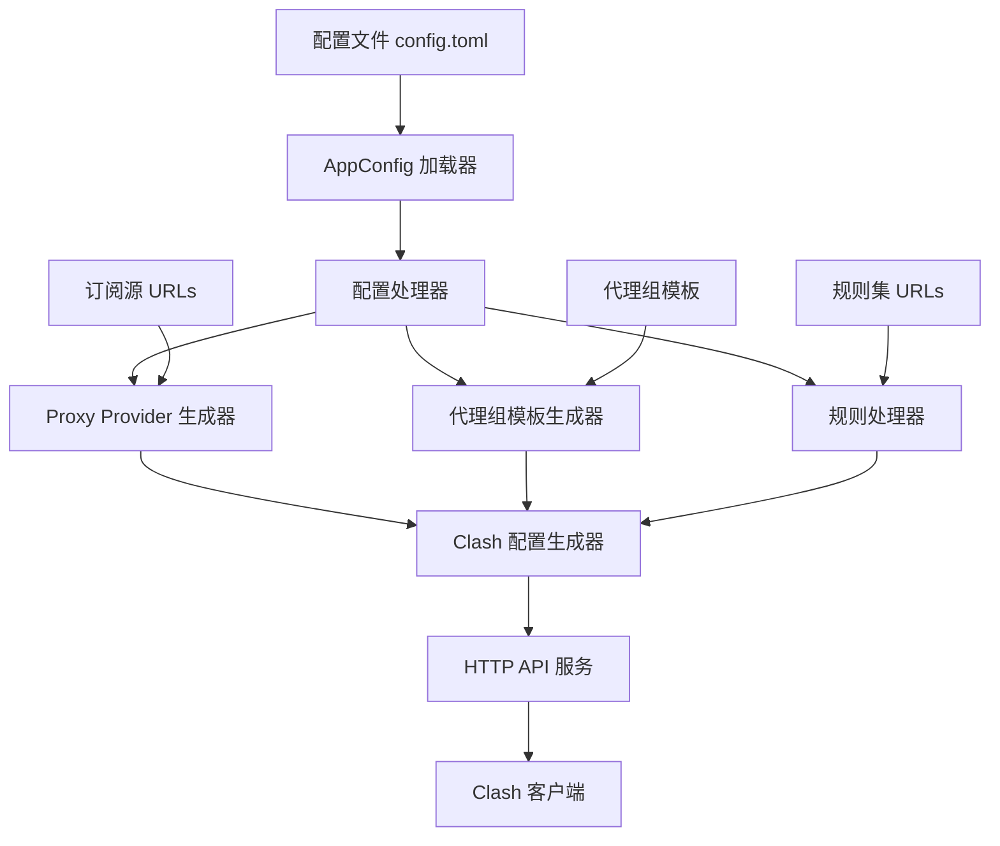
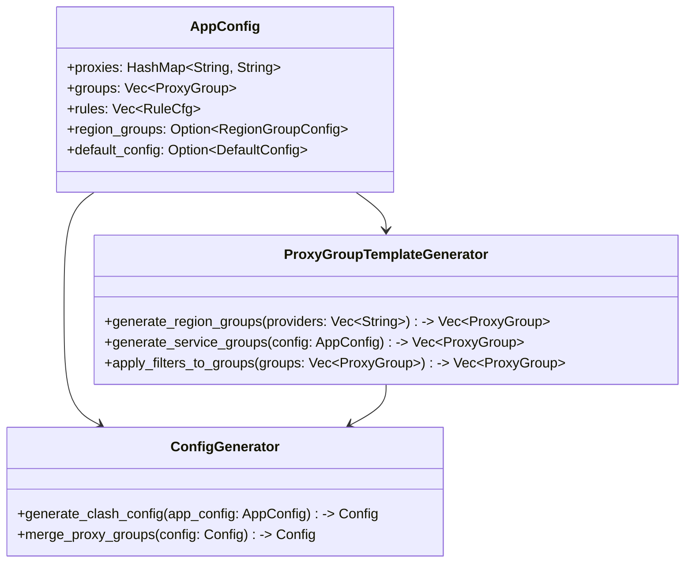

# 设计文档

## 概述

本设计文档描述了如何完善现有的 Clash 订阅合并工具，充分利用 Clash 原生的过滤器和代理组功能，实现智能的订阅合并和代理组管理。

设计的核心理念是：
- 将订阅源配置为 proxy provider，让 Clash 客户端处理所有节点解析
- 利用 Clash 原生的 filter 功能实现地区分组，无需系统解析具体节点
- 通过配置模板自动生成标准的代理组结构
- 支持灵活的规则配置和代理组引用
- 提供完整的配置生成和 HTTP API 服务

## 架构

### 系统架构图



### 核心组件关系



## 组件和接口

### 1. 代理组模板生成器 (ProxyGroupTemplateGenerator)

负责根据配置生成标准的代理组模板，利用 Clash 原生过滤器功能。

```rust
pub struct ProxyGroupTemplateGenerator;

impl ProxyGroupTemplateGenerator {
    pub fn generate_region_groups(providers: &[String], config: &RegionGroupConfig) -> Vec<ProxyGroup>;
    pub fn create_region_select_group(region: &RegionTemplate, providers: &[String]) -> ProxyGroup;
    pub fn create_region_auto_group(region: &RegionTemplate, providers: &[String]) -> ProxyGroup;
    pub fn merge_with_user_groups(generated: Vec<ProxyGroup>, user: Vec<ProxyGroup>) -> Vec<ProxyGroup>;
}
```

### 2. 地区组配置 (RegionGroupConfig)

定义地区代理组的生成规则和过滤器模式。

```rust
#[derive(Debug, Clone, Deserialize)]
pub struct RegionGroupConfig {
    pub enabled: bool,
    pub regions: Vec<RegionTemplate>,
    pub create_auto_groups: bool,
    pub global_filter: Option<String>,
}

#[derive(Debug, Clone, Deserialize)]
pub struct RegionTemplate {
    pub name: String,
    pub display_name: Option<String>,
    pub filter: String,
    pub icon: Option<String>,
}
```

### 3. 增强的应用配置 (Enhanced AppConfig)

扩展现有的 AppConfig 以支持新功能。

```rust
#[derive(Debug, Clone, Deserialize)]
pub struct AppConfig {
    // 现有字段
    pub proxies: HashMap<String, String>,
    pub groups: Vec<ProxyGroup>,
    pub rules: Vec<RuleCfg>,
    
    // 新增字段
    pub region_groups: Option<RegionGroupConfig>,
    pub default_config: Option<DefaultConfig>,
    pub provider_config: Option<ProviderConfig>,
}

#[derive(Debug, Clone, Deserialize)]
pub struct DefaultConfig {
    pub port: Option<u16>,
    pub socks_port: Option<u16>,
    pub mixed_port: Option<u16>,
    pub mode: Option<RunMode>,
    pub log_level: Option<LogLevel>,
    pub allow_lan: Option<bool>,
}

#[derive(Debug, Clone, Deserialize)]
pub struct ProviderConfig {
    pub health_check_url: Option<String>,
    pub health_check_interval: Option<u64>,
    pub update_interval: Option<u64>,
    pub lazy: Option<bool>,
}
```

### 4. 配置生成器增强 (Enhanced ConfigGenerator)

```rust
pub fn generate_clash_config(app_config: AppConfig) -> Config {
    let mut config = Config::default();
    
    // 应用默认配置
    apply_default_config(&mut config, &app_config.default_config);
    
    // 生成 proxy providers
    let proxy_providers = generate_proxy_providers(
        &app_config.proxies, 
        &app_config.provider_config
    );
    
    // 生成地区代理组（如果启用）
    let region_groups = if let Some(region_config) = &app_config.region_groups {
        if region_config.enabled {
            ProxyGroupTemplateGenerator::generate_region_groups(
                &proxy_providers.keys().collect::<Vec<_>>(),
                region_config
            )
        } else {
            Vec::new()
        }
    } else {
        Vec::new()
    };
    
    // 合并所有代理组
    let all_groups = ProxyGroupTemplateGenerator::merge_with_user_groups(
        region_groups,
        app_config.groups
    );
    
    // 生成规则和规则提供者
    let (rule_providers, rules) = generate_rules_and_providers(&app_config.rules);
    
    config.proxy_providers = Some(proxy_providers);
    config.proxy_groups = Some(all_groups);
    config.rule_providers = Some(rule_providers);
    config.rules = Some(rules);
    
    config
}

fn generate_proxy_providers(
    proxies: &HashMap<String, String>,
    provider_config: &Option<ProviderConfig>
) -> HashMap<String, ProxyProvider> {
    let mut providers = HashMap::new();
    
    for (name, url) in proxies {
        let health_check = HealthCheck {
            enable: true,
            url: provider_config
                .as_ref()
                .and_then(|c| c.health_check_url.clone())
                .unwrap_or_else(|| "http://www.gstatic.com/generate_204".to_string()),
            interval: provider_config
                .as_ref()
                .and_then(|c| c.health_check_interval)
                .unwrap_or(300),
            lazy: provider_config
                .as_ref()
                .and_then(|c| c.lazy),
        };
        
        providers.insert(
            name.clone(),
            ProxyProvider::Http(HttpProxyProvider {
                url: url.clone(),
                path: Some(format!("./proxies/{}.yaml", name)),
                common: ProxyProviderCommon {
                    interval: provider_config
                        .as_ref()
                        .and_then(|c| c.update_interval)
                        .or(Some(3600)),
                    health_check: Some(health_check),
                    ..Default::default()
                },
                ..Default::default()
            }),
        );
    }
    
    providers
}
```

## 数据模型

### 地区代理组模板系统

系统通过配置模板自动生成地区代理组，完全依赖 Clash 的过滤器功能：

```yaml
proxy-groups:
  # 全局代理组
  - name: "Proxies"
    type: select
    proxies: ["Auto", "HK", "US", "JP", "SG", "DIRECT"]
    use: ["provider1", "provider2"]
    
  - name: "Auto"
    type: url-test
    use: ["provider1", "provider2"]
    url: "http://www.gstatic.com/generate_204"
    interval: 300
    
  # 地区代理组（通过过滤器自动筛选）
  - name: "HK"
    type: select
    proxies: ["HK-Auto"]
    use: ["provider1", "provider2"]
    filter: "(?i)(hk|hong kong|香港|港)"
    
  - name: "HK-Auto"
    type: url-test
    use: ["provider1", "provider2"]
    filter: "(?i)(hk|hong kong|香港|港)"
    url: "http://www.gstatic.com/generate_204"
    interval: 300
    
  - name: "US"
    type: select
    proxies: ["US-Auto"]
    use: ["provider1", "provider2"]
    filter: "(?i)(us|usa|united states|美国|美)"
    
  - name: "US-Auto"
    type: url-test
    use: ["provider1", "provider2"]
    filter: "(?i)(us|usa|united states|美国|美)"
    url: "http://www.gstatic.com/generate_204"
    interval: 300
```

### 默认地区模板配置

系统内置常用地区的过滤器模式：

```rust
pub fn get_default_region_templates() -> Vec<RegionTemplate> {
    vec![
        RegionTemplate {
            name: "HK".to_string(),
            display_name: Some("香港".to_string()),
            filter: "(?i)(hk|hong kong|香港|港)".to_string(),
            icon: Some("🇭🇰".to_string()),
        },
        RegionTemplate {
            name: "US".to_string(),
            display_name: Some("美国".to_string()),
            filter: "(?i)(us|usa|united states|美国|美)".to_string(),
            icon: Some("🇺🇸".to_string()),
        },
        RegionTemplate {
            name: "JP".to_string(),
            display_name: Some("日本".to_string()),
            filter: "(?i)(jp|japan|日本|日)".to_string(),
            icon: Some("🇯🇵".to_string()),
        },
        RegionTemplate {
            name: "SG".to_string(),
            display_name: Some("新加坡".to_string()),
            filter: "(?i)(sg|singapore|新加坡|新)".to_string(),
            icon: Some("🇸🇬".to_string()),
        },
        RegionTemplate {
            name: "TW".to_string(),
            display_name: Some("台湾".to_string()),
            filter: "(?i)(tw|taiwan|台湾|台)".to_string(),
            icon: Some("🇹🇼".to_string()),
        },
        RegionTemplate {
            name: "KR".to_string(),
            display_name: Some("韩国".to_string()),
            filter: "(?i)(kr|korea|韩国|韩)".to_string(),
            icon: Some("🇰🇷".to_string()),
        },
    ]
}
```

### 规则配置增强

支持在规则配置中直接引用地区组：

```toml
[[rules]]
type = "set"
name = "openai"
url = "https://example.com/openai.yaml"
behavior = "classical"
target = "US"  # 直接引用地区组

[[rules]]
type = "single"
tag = "DOMAIN"
value = "google.com"
target = "HK-Auto"  # 引用地区自动测试组
```

## 错误处理

### 错误类型定义

```rust
#[derive(Debug)]
pub enum ConfigError {
    InvalidSubscriptionUrl(String),
    RegionIdentificationFailed(String),
    ProxyGroupGenerationFailed(String),
    RuleProcessingFailed(String),
    ConfigValidationFailed(String),
}
```

### 错误处理策略

1. **订阅源错误**: 记录错误但继续处理其他订阅源
2. **地区识别失败**: 将节点归类到 "Other" 组
3. **代理组生成失败**: 使用默认代理组配置
4. **规则处理失败**: 跳过有问题的规则并记录警告

## 测试策略

### 单元测试

1. **ProxyGroupTemplateGenerator 测试**
   - 测试地区代理组模板生成
   - 测试过滤器配置正确性
   - 测试代理组合并逻辑

2. **ConfigGenerator 测试**
   - 测试完整配置生成
   - 测试默认值应用
   - 测试 provider 配置生成

3. **配置解析测试**
   - 测试 TOML 配置文件解析
   - 测试配置验证逻辑
   - 测试错误处理

### 集成测试

1. **端到端配置生成测试**
   - 使用模拟订阅源测试
   - 验证生成的 YAML 配置有效性
   - 测试 HTTP API 响应

2. **配置兼容性测试**
   - 验证生成的配置符合 Clash 规范
   - 测试过滤器在实际 Clash 客户端中的工作情况

### 性能测试

1. **大量订阅源处理测试**
2. **配置生成响应时间测试**
3. **内存使用优化测试**

## 配置示例

### 增强的 config.toml 示例

```toml
# 默认配置
[default-config]
mixed-port = 7890
allow-lan = true
mode = "rule"
log-level = "info"

# Provider 配置
[provider-config]
health-check-url = "http://www.gstatic.com/generate_204"
health-check-interval = 300
update-interval = 3600
lazy = true

# 地区代理组配置
[region-groups]
enabled = true
create-auto-groups = true

# 自定义地区模板
[[region-groups.regions]]
name = "HK"
display-name = "香港"
filter = "(?i)(hk|hong kong|香港|港)"
icon = "🇭🇰"

[[region-groups.regions]]
name = "US"
display-name = "美国"
filter = "(?i)(us|usa|united states|美国|美)"
icon = "🇺🇸"

[[region-groups.regions]]
name = "JP"
display-name = "日本"
filter = "(?i)(jp|japan|日本|日)"
icon = "🇯🇵"

# 订阅源配置
[proxies]
provider1 = "https://example1.com/clash"
provider2 = "https://example2.com/clash"

# 服务特定代理组
[[groups]]
name = "OpenAI"
type = "select"
proxies = ["US", "US-Auto", "Proxies"]

[[groups]]
name = "Netflix"
type = "select"
proxies = ["HK", "US", "JP", "SG"]

[[groups]]
name = "Apple"
type = "select"
proxies = ["DIRECT", "HK", "US"]

# 规则配置
[[rules]]
type = "set"
name = "openai"
url = "https://example.com/openai.yaml"
behavior = "classical"
target = "OpenAI"

[[rules]]
type = "set"
name = "netflix"
url = "https://example.com/netflix.yaml"
behavior = "classical"
target = "Netflix"

[[rules]]
type = "set"
name = "apple"
url = "https://example.com/apple.yaml"
behavior = "domain"
target = "Apple"
```

### 生成的 Clash 配置示例

```yaml
mixed-port: 7890
allow-lan: true
mode: rule
log-level: info

proxy-providers:
  provider1:
    type: http
    url: "https://example1.com/clash"
    path: "./proxies/provider1.yaml"
    interval: 3600
    health-check:
      enable: true
      url: "http://www.gstatic.com/generate_204"
      interval: 300
      lazy: true

proxy-groups:
  - name: "Proxies"
    type: select
    proxies: ["Auto", "HK", "US", "JP", "SG"]
    use: ["provider1", "provider2"]
    
  - name: "Auto"
    type: url-test
    use: ["provider1", "provider2"]
    url: "http://www.gstatic.com/generate_204"
    interval: 300
    
  - name: "HK"
    type: select
    proxies: ["HK-Auto"]
    use: ["provider1", "provider2"]
    filter: "(?i)(hk|hong kong|香港|港)"
    
  - name: "HK-Auto"
    type: url-test
    use: ["provider1", "provider2"]
    filter: "(?i)(hk|hong kong|香港|港)"
    url: "http://www.gstatic.com/generate_204"
    interval: 300

  - name: "OpenAI"
    type: select
    proxies: ["US", "US-Auto", "Proxies"]

rule-providers:
  openai:
    type: http
    url: "https://example.com/openai.yaml"
    path: "./rules/openai.yaml"
    behavior: classical
    interval: 86400

rules:
  - RULE-SET,openai,OpenAI
  - MATCH,Proxies
```